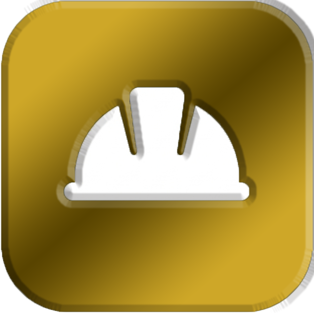

  

# 📦 Logis — B2B Industrial Portal

Clean, professional, and built for scale. **Logis** is a customer-facing interface designed specifically for global logistics and utility management. It provides industrial clients with a calm, clear way to monitor their consumption, manage active service contracts, and handle team-wide security permissions.

> **Note**: This is a frontend-focused concept project created for my portfolio. It's built to demonstrate high-end UI/UX, complex state management, and modern React 19 implementation. All data is currently mocked, and forms serve as UI demonstrations.

### 🌐 Live Demo
You can explore the live portal here: [**View Live Demo**](https://andreap2a.github.io/logis-b2b-portal/)

---

### ✨ Highlights
- **Aesthetic**: A "Soft Professional" design system using high-saturation / low-opacity accents for a luminous, clean feel.
- **Utility Tracking**: Highly visual consumption cards for Electricity, Water, and Industrial Gas with interactive progress monitoring.
- **Legal & Compliance**: Dedicated module for contract management, document tracking, and industrial audit status.
- **Team Intelligence**: Role-based access management with security policy enforcement (MFA).
- **Responsive**: Fully optimized for professional use on desktops, tablets, and mobile devices.

### 🚀 Tech Stack
- **Core**: React 19 + Vite 7
- **Logic**: TypeScript 5.9
- **Styling**: TailwindCSS 4 (New single-file engine)
- **Icons**: Lucide React

### 🛠️ Local Development
1. Clone the repository: `git clone https://github.com/AndreaP2A/logis-b2b-portal.git`
2. Install dependencies: `npm install`
3. Run dev server: `npm run dev`

### 🎨 Customization
- **Branding**: Update the logo by replacing `public/favicon.png`.
- **Theming**: Centralize colors and component tokens in `src/index.css`.
- **Data**: All portal content (Services, Team, Contracts) is managed in `src/data/mock.ts`.

### 📄 License
This project is MIT licensed.
